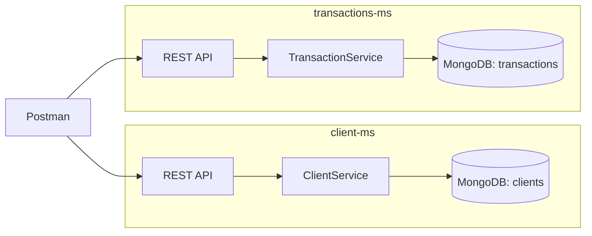
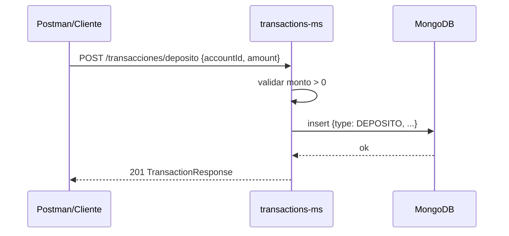
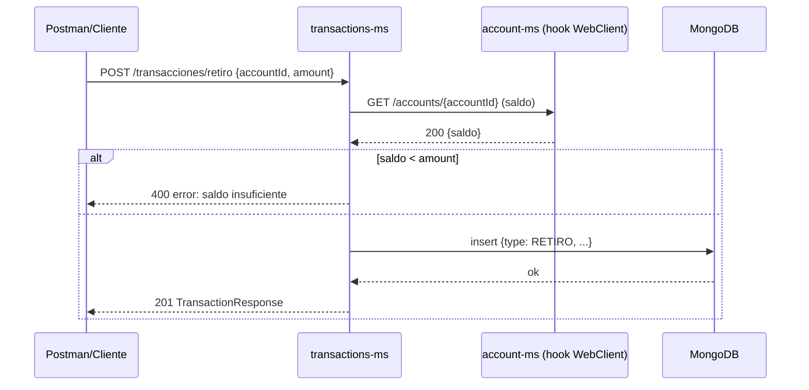

# Diagramas (Mermaid)

## Componentes

```mermaid
flowchart LR
  subgraph Client-MS [client-ms]
    CLIAPI[REST API] --> CLISVC[ClientService]
    CLISVC --> CLIREPO[(MongoDB: clients)]
  end

  subgraph Transactions-MS [transactions-ms]
    TXAPI[REST API] --> TXSVC[TransactionService]
    TXSVC --> TXREPO[(MongoDB: transactions)]
  end

  Postman --> CLIAPI
  Postman --> TXAPI
```

## Secuencia: Depósito

```mermaid
sequenceDiagram
  participant C as Postman/Cliente
  participant T as transactions-ms
  participant DB as MongoDB
  C->>T: POST /transacciones/deposito {accountId, amount}
  T->>T: validar monto > 0
  T->>DB: insert {type: DEPOSITO, ...}
  DB-->>T: ok
  T-->>C: 201 TransactionResponse
```

## Secuencia: Retiro con validación de saldo (hook a account-ms)

```mermaid
sequenceDiagram
  participant C as Postman/Cliente
  participant T as transactions-ms
  participant A as account-ms (hook WebClient)
  participant DB as MongoDB
  C->>T: POST /transacciones/retiro {accountId, amount}
  T->>A: GET /accounts/{accountId} (saldo)
  A-->>T: 200 {saldo}
  alt saldo < amount
    T-->>C: 400 error: saldo insuficiente
  else
    T->>DB: insert {type: RETIRO, ...}
    DB-->>T: ok
    T-->>C: 201 TransactionResponse
  end
```
